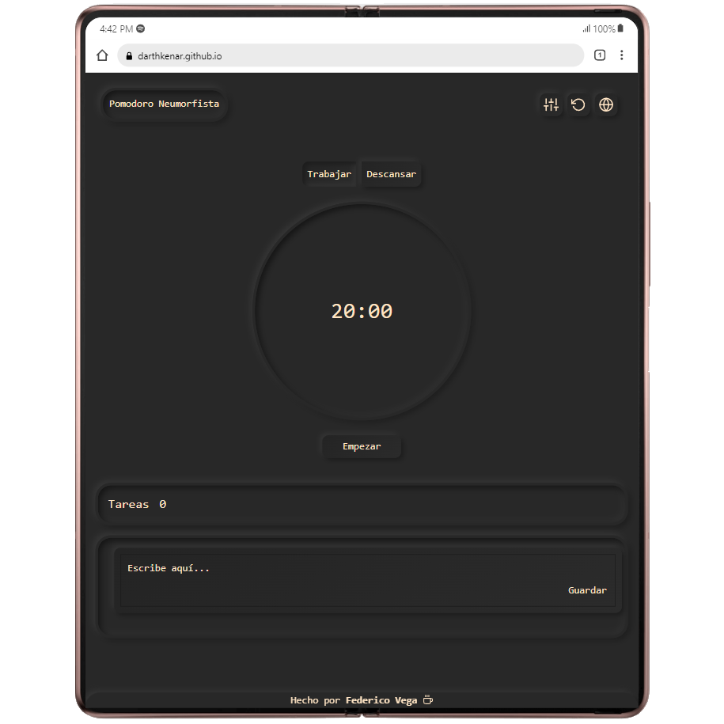

# POMODORO TIMER NEUMORFISTA
Temporizador Pomodoro para mantener la concentración y organizar tus tareas.

Utilízalo en:
[https://darthkenar.github.io/PomodoroNeumorphism/](https://darthkenar.github.io/PomodoroNeumorphism/)

## Con este gestionador de tareas podes

- Establecer tus configuraciones para POMODORO.
- Añadir, eliminar y editar tareas.
- Eficientizar tu tiempo de trabajo y estudio.
- Recibir notificaciones y sonido de alarma cuando finalizas los periodos de estudio/descanso.
- Crear, editar o eliminar tareas y ordenarlas a tu gusto.
- Mantener la concentración gracias al diseño neumorfista.
